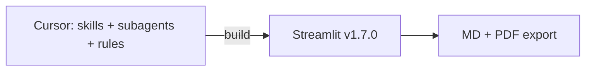

# BeerMe v1.7.0 + agent pilot — caveman summary

Download/share this file. Canonical long-form: `docs/sop/ai-driven-development-sop.md`.

---

## TL;DR

- `./run.sh` = **v1.7.0 app** (Streamlit). User delta: **PDF download** on results (+ MD unchanged).
- **Skills/subagents = Cursor only**. Not in browser. Guide how you build, not runtime.
- **#86 + #93 merged** to `main` (`153e7df`). Phase 5 closed. BeerMe = reference SOP repo.

---

## Two layers

| Layer | What | Where |
|-------|------|-------|
| **Runtime** | Quiz → taste profile → rec tree → MD/PDF export | `./run.sh`, `app/` |
| **Dev process** | Subagents, rules, skills, 7-phase SOP | `.cursor/`, `docs/sop/`, `AGENTS.md` |



---

## App changes (PR #93) — see in browser

| Change | File |
|--------|------|
| PDF download button | `app/main.py` |
| PDF bytes | `app/export_pdf.py` (fpdf2) |
| `collect_beer_leaves()` public | `app/recommender.py` |
| Blurb max 120 chars | `app/prompts.py` (`BLURB_MAX_CHARS`) |
| 26 pytest | `tests/test_export_pdf.py`, `test_prompts.py`, `test_recommender.py` |
| Smoke: PDF + offline import | `scripts/qa/beerme-smoke.sh` |

**Confirm:** finish quiz → results → **Download recommendations (.pdf)** next to MD.

---

## Agent doctrine (PR #86) — Cursor only

| Artifact | Purpose |
|----------|---------|
| `AGENTS.md` | Vision, 6 non-negotiables, zone routing, workflow |
| `.cursor/agents/orion.md` | LLM — `prompts.py`, `ollama_client.py` |
| `.cursor/agents/engine.md` | Core — `taste_profile.py`, `recommender.py`, `data/*` |
| `.cursor/agents/voyager.md` | UI — `main.py`, `export_md.py`, `export_pdf.py` |
| `.cursor/agents/verify.md` | QA readonly — pytest, smoke, gates |
| `.cursor/rules/*.mdc` (4) | Auto boundaries by file glob |
| `docs/cursor-teams/` | Usage guide, release gates, handoff template |

**Invoke:** new chat → `@AGENTS.md` `@CONTEXT.md` → `/engine` or `/orion` or `/voyager` on ticket. Phase close → `/verify`.

---

## Skills vs subagents

| | Install | Invoke |
|--|---------|--------|
| **Skills** | [Practical-Office/cursor-skills](https://github.com/Practical-Office/cursor-skills) → `~/.cursor/skills/` | `tdd`, `to-prd`, `to-issues`, `qa`, `triage`, … |
| **Subagents** | In repo `.cursor/agents/` | `/orion`, `/engine`, `/voyager`, `/verify` |
| **Rules** | In repo `.cursor/rules/` | Auto on matching paths |

Repo ships subagents + rules. Skills = once per machine.

---

## Doc index (copy to other projects)

| Doc | Role |
|-----|------|
| `docs/sop/ai-driven-development-sop.md` | **Canonical** 7-phase OS (Idea→QA) |
| `docs/sop/agent-doctrine-pilot.md` | Greenfield checklist |
| `docs/sop/prd-cycle-sop.full.md` | PRD-cycle addendum |
| `docs/workflow/skills-map.md` | Phase → skill → subagent |
| `docs/prd/PRD.md` | v1.7.0 product intent |
| `docs/phases/phase-5-pdf-export/` | Kickoff, WBS, delta, handoff |
| `docs/sop/verification-addendum.md` | Pilot learnings |
| `docs/session-handoff.md` | Current state (long form) |

GitHub issues **#87–#92** = Phase 5 ticket evidence (closed).

---

## Non-negotiables (BeerMe)

1. LLM → axis updates; **Python** → session confidence
2. Recs = **catalog IDs only**
3. LLM prose OK; no score/catalog/confidence changes
4. Ollama in `ollama_client.py`; pytest = fixtures
5. **One issue → one chat**
6. **Board wins** — no personal backlogs

---

## Local setup (your machine)

```bash
cd /Users/jamesmair/Projects/beerme-github
python3 -m venv .venv && source .venv/bin/activate
pip install -r requirements.txt
PYTHONPATH=. pytest -q
ollama pull llama3.2:3b
./run.sh
```

`run.sh` needs **`.venv` inside repo** — activated venv elsewhere not enough.

`/Users/jamesmair/Projects/beerme` = SOP stub only (no git). **Use beerme-github.**

---

## Remaining human gates

1. **pytest** — 26 passed
2. **Smoke** — `bash scripts/qa/beerme-smoke.sh` (PDF step)
3. **Cursor routing** — open `app/prompts.py` → rule `01-llm-boundary` attaches; `/verify` readonly

No open product work until new PRD scope (`to-prd`).

---

## Copy pattern → greenfield repo

1. `setup-practical-ai-skills` once
2. Scale `AGENTS.md` + `.cursor/agents/` + `.cursor/rules/`
3. Add `docs/cursor-teams/` trio
4. Canonical `docs/sop/ai-driven-development-sop.md`
5. First phase: WBS tags subagent per ticket

| Shape | Subagents | Rules |
|-------|-----------|-------|
| Single app (BeerMe) | 4 (`/orion` `/engine` `/voyager` `/verify`) | 4 `.mdc` |
| Monorepo (BookIQ) | 6 teams + Polaris | 8+ + CONTEXT_PACK |

---

## PR merge history

| PR | Content |
|----|---------|
| #86 | Agent doctrine, subagents, rules, cursor-teams |
| #93 | PDF export, canonical SOP, Phase 5 artifacts |

Both on `main` as of 2026-06-02.
